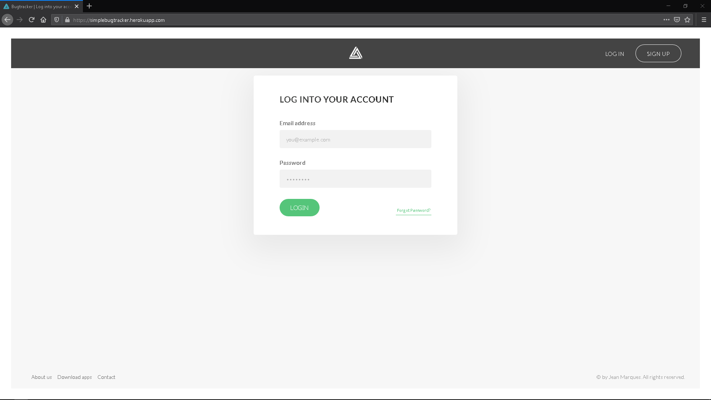
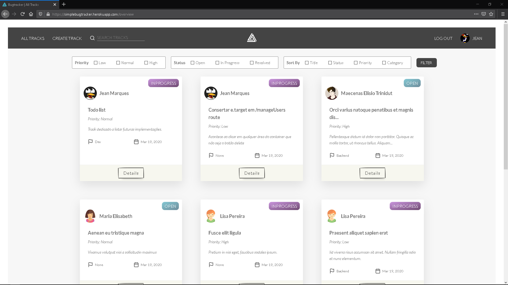
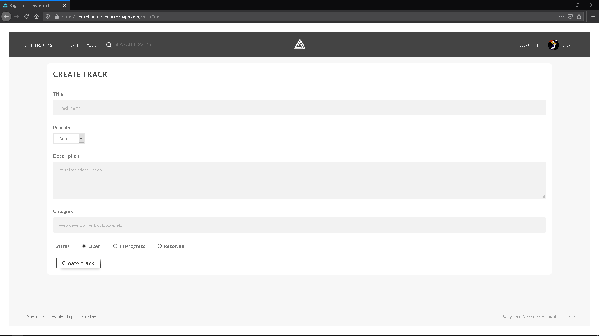
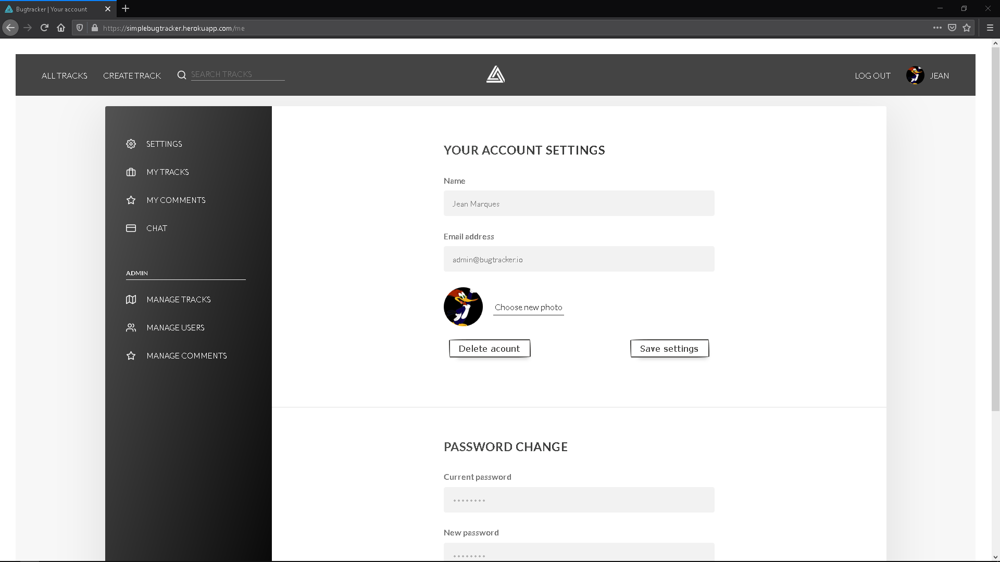
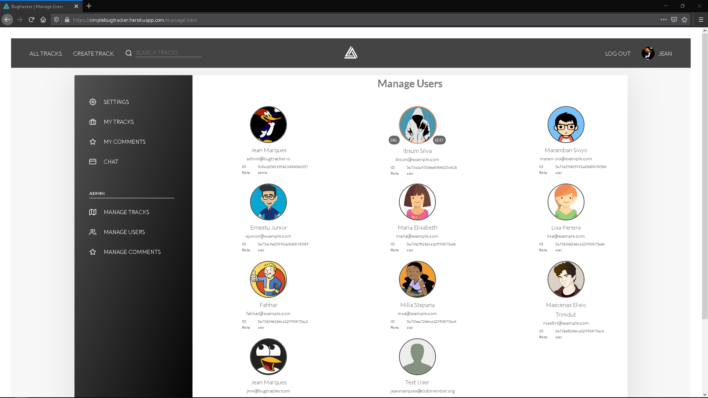
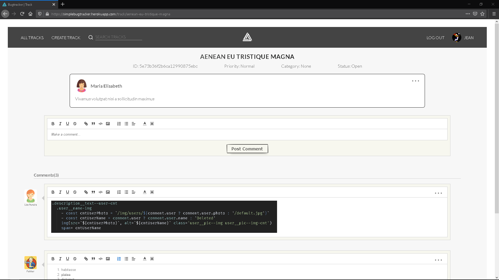

# Simple Bugtracker

A personal project built with expressjs and mongoose on the backend and pug, css, javascript for frontend. Some screenshots:

## TODO

* Implement quill form for "track description"
* Route for Forgot Password
* Add feature to edit track
* Add feature to edit user (only for roles admin and owner)
* Redo interface using sass OR even redo frontend using react
* Make all the pages fully responsive
* Add chat and private messages
* Continuosly improve src code
* After every core features are implemented, only allow owner and admins to add users for related project

## Website

[https://simplebugtracker.herokuapp.com](https://simplebugtracker.herokuapp.com)

Account for testing: ibsum@example.com password: 123456789 or just sign up.
